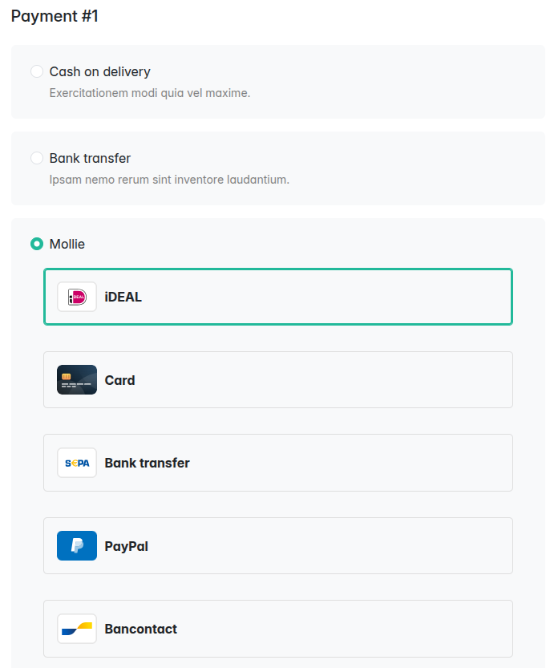
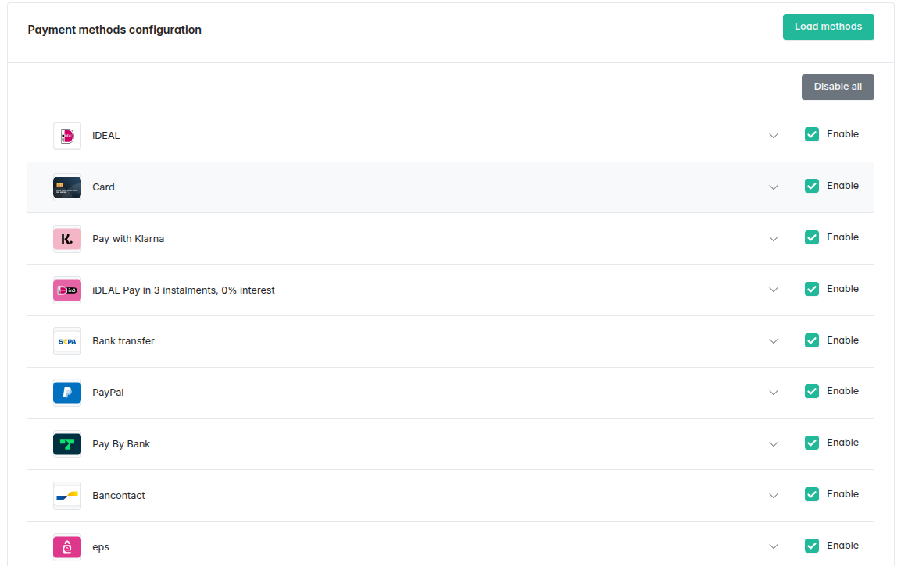
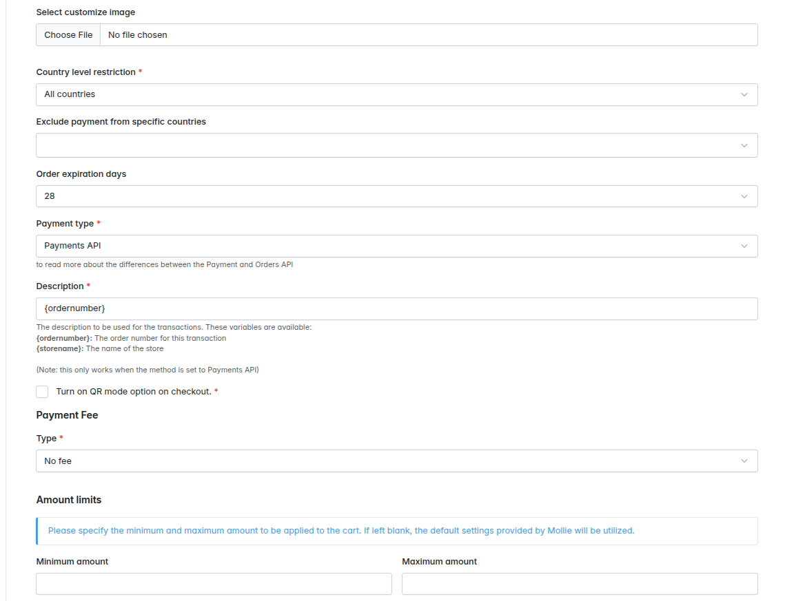

<p align="center">
    <a href="https://sylius.com" target="_blank">
        <picture>
          <source media="(prefers-color-scheme: dark)" srcset="https://media.sylius.com/sylius-logo-800-dark.png">
          <source media="(prefers-color-scheme: light)" srcset="https://media.sylius.com/sylius-logo-800.png">
          
        </picture>
    </a>
</p>

<h1 align="center">Mollie Payments Plugin</h1>

<p align="center"><a href="https://sylius.com/plugins/" target="_blank"></a></p>

<p align="center">This plugin provides seamless Mollie integration for Sylius stores.</p>

<p align="center">Accept payments through over 20 different methods with Mollie – trusted by over 70,000 businesses in Europe.</p>

---

## Table of Contents

* [Overview](#overview)
* [Demo](#mollie-plugin-demo)
* [Installation](#installation)
  * [Usage](#usage)
  * [Recurring subscription (internal CRON)](doc/recurring.md)
* [Recurring payments](doc/recurring.md)
* [Community](#community)

---

## Overview





[Mollie](https://www.mollie.com/) is one of the most advanced and developer-friendly payment gateways in Europe. This plugin integrates Mollie into Sylius and is officially certified by Mollie.

> Our mission is to create a greater playing field for everyone. By offering convenient, safe world-wide payment solutions we remove barriers so you could focus on growing your business.

Mollie provides a powerful API allowing webshop and app developers to implement over 20 payment methods with ease. Their services are fast, reliable, and constantly innovating the European payments landscape.

---

## Demo

You can quickly test the plugin using Docker. Just run:

```bash
docker run -p 8080:80 -p 8025:8025 ghcr.io/sylius/mollieplugin:2.0
```

If you'd like to run it in development mode (with debug tools enabled), use:

```bash
docker run -p 8080:80 -p 8025:8025 -e APP_ENV=dev -e APP_DEBUG=1 ghcr.io/sylius/mollieplugin:2.0
```

---

## Installation

#### Beware!

This installation instruction assumes that you're using Symfony Flex and Rector. If you don't, take a look at the
[legacy installation instruction](doc/legacy_installation.md). However, we strongly encourage you to use them, it's much quicker!

#### 1. Ensure that you have `wkhtmltopdf` installed, and that you have the proper path to it set in the .env file (`WKHTMLTOPDF_PATH` and `WKHTMLTOIMAGE_PATH` variables)(Visit [RefundPlugin](https://github.com/Sylius/RefundPlugin) for more information).

#### 2. Require Mollie plugin with composer:

```bash
composer require sylius/mollie-plugin:^3.0 --no-scripts -W
```

#### 3. Add the Mollie rector set:

```diff
   # <project_root>/rector.php

   ...
   + use Sylius\SyliusRector\Set\SyliusMollie;

   return static function (RectorConfig $rectorConfig): void {
       ...
   +   $rectorConfig->sets([SyliusMollie::MOLLIE_PLUGIN_30]);
   };
```
and run it:
```bash
vendor/bin/rector
```

#### 4. Update your database

```
bin/console doctrine:migrations:migrate
```

#### 5. Install frontend assets:

```bash
bin/console assets:install
```

Install additional dependencies:
```bash
yarn add bazinga-translator intl-messageformat lodash.get shepherd.js@11.0
```

Build assets:

```bash
yarn encore dev # for development
yarn encore production # for production
```

#### 6. Clear cache:

```bash
php bin/console cache:clear
```

## Optional and troubleshooting

1. [Optional] Load fixtures:

   ```bash
   bin/console sylius:fixtures:load
   ```

1. [Optional] Add the payment link cronjob:

   ```shell script
   * * * * * /usr/bin/php /path/to/bin/console mollie:send-payment-link
   ```

1. [Optional] If you want to use ApplePay, you need to add the [domain validation file](https://www.mollie.com/.well-known/apple-developer-merchantid-domain-association) file to your server at:
   ```
   public/.well-known/apple-developer-merchantid-domain-association
   ```

## ⚠️ SyliusRefundPlugin Troubleshooting

If you encounter an error related to duplicate transitions in the `sylius_refund_refund_payment` state machine (e.g. multiple `"complete"` transitions from `"new"` state),  
you should **remove the following file** from your project:
```
config/packages/sylius_refund.yaml
```
You should remove it **if your project does not use Symfony Workflow**

## Sylius API
In order to create Mollie payment with Sylius API, the following steps must be followed:

- send the following request to the Sylius API in order to retrieve Mollie payment method configuration: /api/v2/shop/orders/{tokenValue}/payments/{paymentId}/configuration
- tokenValue represents order token which is saved in the sylius_order DB table
- response from this endpoint should be in the following format:

```json
{
  "method": "ideal",
  "issuer": "ideal_ABNANL2A",
  "cardToken": null,
  "amount": {"value":"18.75","currency":"EUR"},
  "customerId": null,
  "description": "000000157",
  "redirectUrl": "{redirect_url}",
  "webhookUrl": "{webhook_url}",
  "metadata": {"order_id":170,"customer_id":22,"molliePaymentMethods":"ideal","cartToken":null,"saveCardInfo":null,"useSavedCards":null,"selected_issuer":"ideal_ABNANL2A","methodType":"Payments API","refund_token":"{token}"},
  "locale": "en_US"
}
```
- create the payment on Mollie, using Mollie API. Response from the above-mentioned step should be put in the request body.
  Request should be sent to the POST: https://api.mollie.com/v2/payments. Bearer token should be sent in the request authorization header.
  Token can be copied from the Mollie admin configuration page.

- after payment has been created, API response will contain checkout field. User should enter this url in the browser.

```json
{
  "checkout": 
    {
    "href": "https://www.mollie.com/checkout/test-mode?method=ideal&token=6.voklib",
    "type": "text/html"
}}
```
- open checkout url in the browser and complete the payment

## Usage

During configuration, first save the keys to the database and then click "Load methods".

### Rendering Mollie credit card form

You can use:

- `SyliusMolliePlugin:DirectDebit:_form.html.twig`
- `@SyliusMolliePlugin/Grid/Action/cancelSubscriptionMollie.html.twig`

See [these examples](tests/Application/templates/bundles/SyliusShopBundle).

## Security issues

If you think that you have found a security issue, please do not use the issue tracker and do not post it publicly.
Instead, all security issues must be sent to `security@sylius.com`

## Community

For online communication, we invite you to chat with us & other users on [Sylius Slack](https://sylius-devs.slack.com/).
